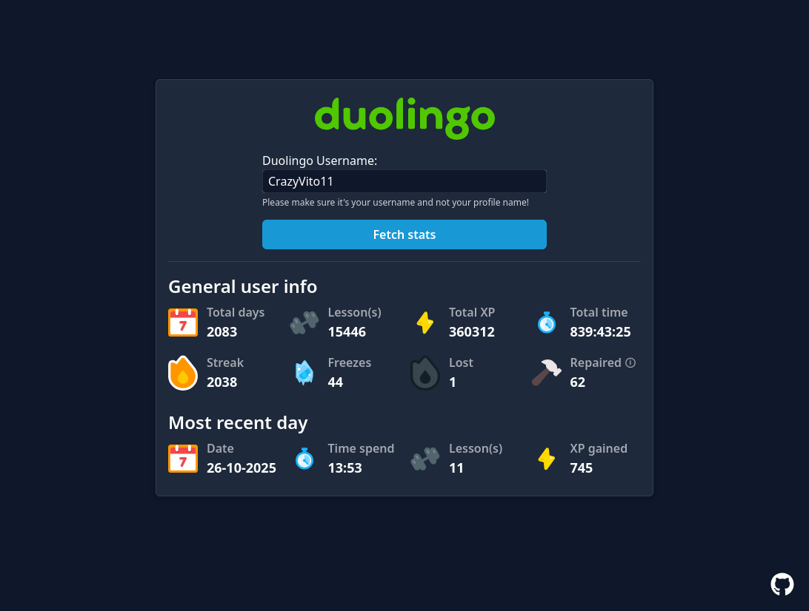

# Duostats
Simple website that gets some more detailed stats from Duolingo.

## Setup
To setup an environment for general use, you need to follow these steps:

1. Make sure you meet the follow prerequisites
    - Docker + Docker Compose have been installed
    - The [Traefik reverse proxy container](https://github.com/CrazyVito11/traefik-reverse-proxy) has been configured
    - A registered domain name
        - You can use something like [PiHole](https://github.com/pi-hole/pi-hole) to register local domains if you aren't going to host it publicly
2. Clone this repository to your server
3. Make a copy of `.env.example` and call it `.env`
4. Edit the variables in `.env` until they fit your situation
    - Your domain name can be entered in here for example
5. Build the container with `docker compose build`

The container should now be ready, simply start it with `docker compose up -d` and try visiting your domain!

## Setup (Development)
To setup an environment for development, you need to follow these steps:

1. Make sure you meet the follow prerequisites
    - Docker + Docker Compose have been installed
    - The [Traefik reverse proxy container](https://github.com/CrazyVito11/traefik-reverse-proxy) has been configured
2. Clone this repository to your development machine
3. Make a copy of `.env.example` and call it `.env`
4. Edit the variables in `.env` until they fit your situation
    - It's recommended that use use an `.localhost` domain, as this doesn't require any custom DNS settings of servers
5. Build the container with `docker compose -f development.docker-compose.yml build`

The container should now be ready, simply start it with `docker compose -f development.docker-compose.yml up -d` and try visiting your localhost environment!
